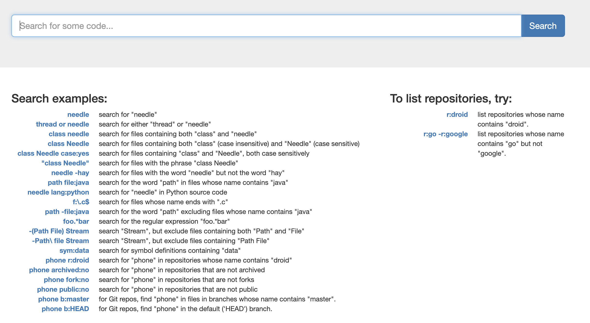
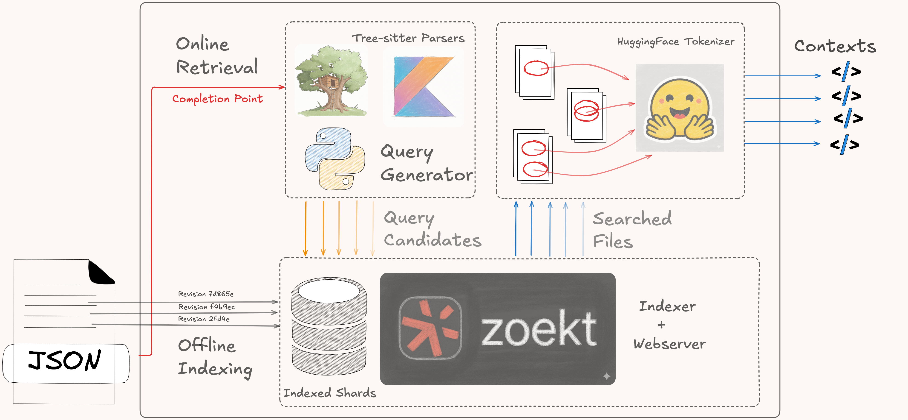

# Spare Code Context

<p align="center">
    
</p>

Official implementation of the "SpareCodeSearch: How to *search* for *code* context when you do not have a *spare* GPU" - submitted at the [ASE 2025 Context Collection Workshop](https://jetbrains-research.github.io/ase2025-context-collection-workshop/).

This solution also won the golden price in [Kotlin track](https://lp.jetbrains.com/research/context-collection-competition/?tab-1756138596455-4232=kotlin) 🥇 and the silver price in [Python track](https://lp.jetbrains.com/research/context-collection-competition/?tab-1756138596455-4232=python) 🥈 of the corresponding Context Collection Competition organized by Jetbrains and Mistral AI.

## Quickstart
SpareCodeSearch ultilizes [Zoekt](https://github.com/sourcegraph/zoekt) for key-word based search. No GPU is required for this process. Make sure you have [Docker engine](https://docs.docker.com/engine/) and [Docker Compose](https://docs.docker.com/compose/install/) installed to run the submodules and microservices included in this project.
### Clone the repository and its submodules (Zoekt)
```bash
git clone --recurse-submodules https://github.com/minhna1112/spare-code-search.git
git submodule update --remote zoekt
```
The submodule [zoekt](https://github.com/minhna1112/zoekt) is a forked version from the original repository provided by Sourcegraph. Instead of using the current Zoekt [image](https://hub.docker.com/r/sourcegraph/zoekt) on Dockerhub, we chose to build the image from scratch, with `ctags`, `zoekt-indexserver`, and `zoekt-webserver` installed in the process. See the [Dockerfile](https://github.com/minhna1112/zoekt/blob/main/Dockerfile) for more details.
### Build the Zoekt Code Search Server Docker image on local machine
Run the following command to build the Zoekt Docker image:
```bash
 cd zoekt && docker build -t zoekt-local:v0.0.1 . && docker tag zoekt-local:v0.0.1 zoekt-local:latest
```
### Prepare data for indexing:
The structure for data is kept in accordance with the original Code Context competition data structure, which is as follows:
```bash
data
├── {language}-{stage}.jsonl # Competition data
└── repositories-{language}-{stage} # Folder with repositories
    └── {owner}__{repository}-{revision} # Repository revision used for collecting context
        └── repository contents
```
More details on how to download and prepare the original competition data can be found in its [starter repository](https://github.com/JetBrains-Research/ase2025-starter-kit?tab=readme-ov-file#getting-started).

To use your own custom data, make sure to follow the same directory structure as the original competition data. Each datapoint in the JSONL file should correspond to the following format.
```json
{
  "id": "revsionID",
  "repo": "owner/repoName",
  "revision": "repoRevision",
  "path": "path/to/the/file/containing/completion/point",
  "modified": [
    "paths/to/files, that/are/modified, in/the/same/revision"
  ],
  "prefix": "incompletedCodeBeforeCompletionPoint",
  "suffix": "incompletedcodeAftercompletionPoint",
  "archive": "this is optional"
}
```
### Step 1: Index the data
After preparing the data, to index it, you need to run the `zoekt-indexer` service. This service will read the data from the `data` folder and index it for searching. Each datapoint (corresponding to a JSON line in the `{language}-{stage}.jsonl` file) will be indexed as a single shard in the Zoekt index. For starting each of the service below, please you Docker compose: 
```bash
STAGE=public LANGUAGE=kotlin docker-compose up zoekt-indexer
```
For Docker engine with Docker CLI greater than `v20.10`, `compose` plugin can be used, replacing the `docker-compose` standalone applicaiton
```bash
STAGE=public LANGUAGE=kotlin docker compose up zoekt-indexer
```
You can modify the environment variables to match your specific use case (stage and language). The Indexing process will take some time, depending on the size of the data and your machine's performance. On a M3 Macbook Air, the indexing process took about 10-15 minutes, for a dataset of 300-400 repositories. More on how to config the memory and CPU usages for indexing could be found in this Zoekt's [thread](https://github.com/sourcegraph/zoekt/issues/840).
### Step 2: Start the Zoekt web server
 Once the indexing is complete, you can start the `zoekt-webserver` service, exposing `/api/search` at default port 6070. 
```bash
STAGE=public LANGUAGE=kotlin docker-compose up zoekt-webserver
```
or with `compose` plugin
```bash
STAGE=public LANGUAGE=kotlin docker compose up zoekt-webserver
```

On your local machine, a web browser can be used to access the search interface at `http://localhost:6070/`.
 
### Step 3: Build and run the Spare Code Context Docker image
Once everything with Zoekt is set up, and you can now build and run the Spare Code Context Docker image. Everytime you want to run the Spare Code Context, you need to run the following command, which will re-build the image and re-recreate the container.
```bash
docker-compose up spare-code-context --build --force-recreate
```
or with `compose` plugin
```bash
docker compose up spare-code-context --build --force-recreate
```
You can modify the `docker-compose.yml` file to set the appropriate environment variables for your `STAGE` and `LANGUAGE`. All other volumes and environment variables are set in the `docker-compose.yml` file.
```yml
environment:
    - STAGE=${STAGE:-public}  # Default to 'public' stage if not set
    - LANGUAGE=${LANGUAGE:-kotlin}  # Default to 'kotlin' language if not set
    - ZOEKT_URL=http://zoekt-webserver:6070/api/search  # URL of the zoekt web server
```
The `ZOEKT_URL` is the URL of the Zoekt web server that provides the search API, which should be left as is unless you have a custom setup.
All the volumes are mounted to the `spare_code_context` container
```yml
volumes:
    - ./data:/data  # Mount local data directory
    - ./predictions:/predictions  # Mount local predictions directory
    - ./queries:/queries  # Mount local queries directory
```
After every run, you can find the predictions in the `predictions` folder, which will be created if it does not exist. The predictions will be saved in the format `{language}-{stage}-predictions.jsonl`, where `language` and `stage` are the same as in the `docker-compose.yml` file.
There will be two types of outputs generated from the Spare Code Context service:
1. **Predictions**: These are the outputs used for submission to the competition. They represent the code context inside each shard founded by our solution, which serve as the inputs for the Code Language Models to generate the missing completions.  They will be saved in single JSONL file the `predictions` folder. Format of each prediction point:
```json
{
  "context": "The join string of every context founded by Spare Code Search",
  "prefix": "prefix string ",
  "suffix": "suffix string"
}
```
2. **Queries**: These are the queries used to retrieve the code context, via sending them to the Zoekt web server' search API. They will be saved in the `queries` folder, also as a JSONL file, formatting as:
```json
{
  "candidates": 
  {
    "query_type_a": "The query string for type A"
  },
  {
    "query_type_b": "The query string for type B"
  }
}
```

## How it works?
Details on the inner workings of the SpareCodeSearch can be found in the technical [design document](docs/how_it_works.md).
<p align="center">
    
</p>

## Citation
If you want to use the code from this repository, please cite it as follows:

```
@misc{spare-code-search,
  author = {Minh Nguyen},
  title = {Spare Code Search},
  year = {2025},
  publisher = {GitHub},
  journal = {GitHub Repository},
  url = {https://github.com/minhna1112/spare-code-context}
}
